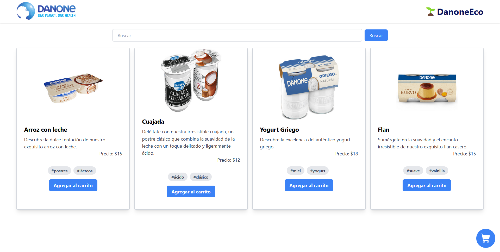

# Danone Hackathon Mexico ErickDevv

## Descripción del proyecto

El proyecto consiste es una aplicación web que da a conocer la línea de productos Eco de Danone. Incorpora un buscador de productos y la posibilidad de tener un carrito de compras.



## Instalación

Para instalar el proyecto se debe clonar el repositorio y ejecutar los siguientes dos comandos en la ***carpeta raíz del proyecto***:

Inicio de la API (puerto 3000):

```bash
cd api
npm install
npm start
```

Inicio del Frontend (puerto 5173):

```bash
cd frontend
npm install
npm run dev
```

Para acceder a la aplicación se debe ingresar a la siguiente dirección: http://localhost:5173/


Si desea ver el sitio web en **producción**, puede acceder a la siguiente dirección: https://danone-hackathon-erickdevv.vercel.app/


## Desarrollo del proyecto:

### **tecnologías**

Para el desarrollo del proyecto se utilizaron las siguentes tecnologías:

- *React (vite)*
- *TailwindCSS*
- *Express*

React permite agilizar el desarrollo de la aplicación del lado del cliente, lo complementé con librerías como React Query para gestionar el estado de las peticiones a la API , y Zustand para hacer uso de un estado global. Mientras que Express permite crear una API REST para el manejo de los datos entre los que se encuentran los productos a mostrar.

Decidí agregar TailwindCSS desde el inicio del desarrollo para agilizar el poder dar estilos a la aplicación. Cabe mencionar que la aplicación es responsive.

### **DevOps**

Para el despliegue de la aplicación se utilizo **Vercel**, esto permitió desplegues de manera rápida. Pero además  brindo la posibilidad de tener ***integración continua*** con GitHub desde el inicio del desarrollo.

En el caso de la API, se utilizó **DigitalOcean** para el despliegue de la misma, al igual que en el caso anterior, se utilizó integración continua con GitHub.


